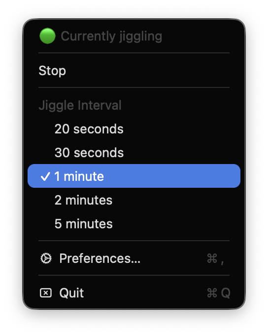
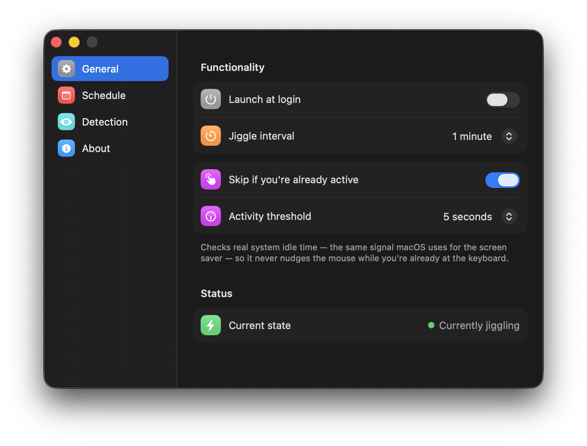
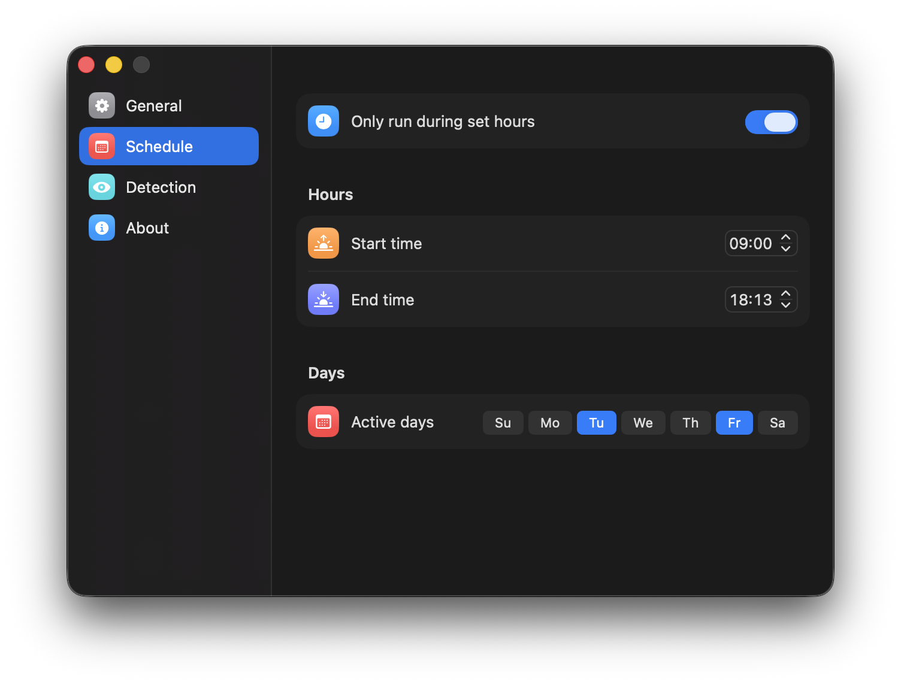
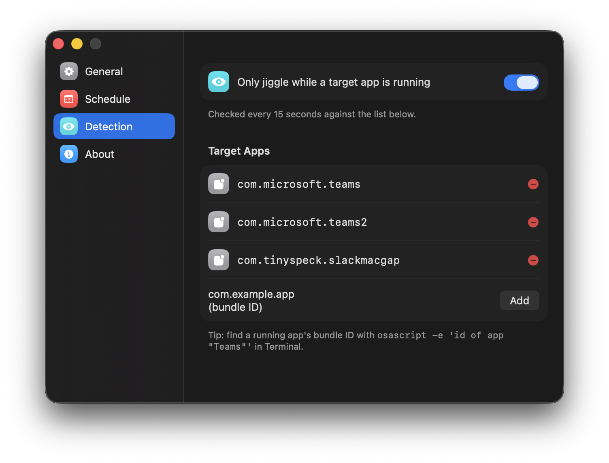

# MouseJiggler 🖱️🟢

[](https://github.com/pedromcdp/MouseJiggler/actions/workflows/release.yml)
[](LICENSE)

A tiny, native macOS menu bar app that nudges your mouse on a schedule —
just enough to keep Teams, Slack, or your screen saver from marking you
away. Free, local, open source. No telemetry, no background server, no
subscription — same idea as movemouse.app, but yours.

## Contents

- [Screenshots](#screenshots)
- [Features](#features)
- [Requirements](#requirements)
- [Build](#build)
- [Install & run](#install--run)
- [Using it](#using-it)
- [Releases](#releases)
- [Project structure](#project-structure)
- [How it works](#how-it-works)
- [Roadmap ideas](#roadmap-ideas)
- [Contributing](#contributing)
- [License](#license)

## Screenshots

| Menu bar | General |
|---|---|
|  |  |

| Schedule | Detection |
|---|---|
|  |  |

## Features

- **Menu bar only** — no Dock icon, lives quietly as a status item
- **Custom schedule** — restrict jiggling to specific days and hours (e.g. weekdays 9–18)
- **App-aware** — optionally only jiggle while Teams and/or Slack are actually running
- **Real idle-detection** — skips the jiggle if you've genuinely used the mouse/keyboard recently (checks actual system idle time, the same signal macOS uses for the screen saver)
- **Configurable interval** — 20s to 5 minutes
- **Launch at login** — one toggle, no manual Login Items setup
- **Live status** — menu bar icon shows 🟢 jiggling, 🟡 skipping (you're already active), ⚪️ stopped/paused

## Requirements

- macOS 13 (Ventura) or later
- Xcode Command Line Tools (not the full Xcode app):
  ```bash
  xcode-select --install
  ```

## Build

```bash
chmod +x build.sh scripts/make_icon.sh
./build.sh
```

This generates the app icon (first run only), compiles the Swift sources, and
produces `build/MouseJiggler.app`. Any previously running instance is killed
first, so a rebuild always reflects what you just built.

## Install & run

```bash
rm -rf /Applications/MouseJiggler.app
mv build/MouseJiggler.app /Applications/
open /Applications/MouseJiggler.app
```

**First launch:** macOS may not prompt automatically since it's an unsigned
(ad-hoc signed) build. If the jiggle doesn't seem to do anything, add it
manually:
**System Settings → Privacy & Security → Accessibility → add MouseJiggler.app**

## Using it

Click the menu bar icon for:
- A live status line (jiggling / skipping / paused / stopped)
- **Start / Stop** — pause without quitting
- **Jiggle Interval** — quick access without opening Preferences
- **Preferences…** — schedule, interval, app-awareness, idle-detection, launch at login
- **Quit**

## Releases

Pushing a version tag (`v1.1`, `v1.2.3`, etc.) triggers
[`.github/workflows/release.yml`](.github/workflows/release.yml), which
builds the app on a real macOS runner, zips it, and attaches it to a new
GitHub Release automatically:

```bash
git tag v1.2.1
git push origin v1.2.1
```

No need to manually build and upload a `.zip` for each release — just tag
and push.

## Project structure

```
MouseJiggler/
├── Sources/
│   ├── main.swift               # entry point
│   ├── AppDelegate.swift        # menu bar + Preferences window wiring
│   ├── JiggleEngine.swift       # timer, schedule, app-detection & idle-detection logic
│   ├── SettingsStore.swift      # persistence (UserDefaults + Codable)
│   ├── SettingsView.swift       # Preferences window container + sidebar
│   ├── SettingsPanes.swift      # General / Schedule / Detection / About panes
│   ├── SettingsComponents.swift # shared UI: icon tiles, weekday picker
│   ├── LoginItemManager.swift   # SMAppService login item wrapper
│   └── Models.swift             # Schedule / AppSettings data types
├── Resources/
│   ├── Info.plist
│   ├── AppIcon-1024.png         # source icon (converted to .icns at build time)
│   └── social-preview.png       # GitHub social preview card
├── docs/screenshots/            # README screenshots
├── scripts/make_icon.sh         # PNG → .icns conversion
├── .github/workflows/release.yml# tag-triggered build & release automation
└── build.sh                     # compiles + packages the .app
```

## How it works

The engine reads the current cursor position, nudges it 1px, then moves it
back 50ms later — enough to reset the OS's idle timer without visibly
disturbing your cursor. A background check every 15 seconds evaluates
whether the current time/day falls in your schedule and whether your chosen
target apps (Teams/Slack) are running. Right before each nudge, it also
checks real system idle time (the same mechanism macOS itself uses for the
screen saver) and skips the nudge entirely if you've genuinely used the
mouse or keyboard more recently than your configured threshold.

## Roadmap ideas

- [ ] Sparkle-based auto-updates for direct (non-App-Store) distribution
- [ ] Notarized, signed release builds via GitHub Actions
- [ ] Mac App Store submission (requires Apple Developer account + proper signing identity)
- [ ] Per-app custom idle thresholds

## Contributing

Contributions and issues are welcome — see [CONTRIBUTING.md](CONTRIBUTING.md)
for how to get set up and what to know before opening a PR.

## License

MIT — see [LICENSE](LICENSE).
